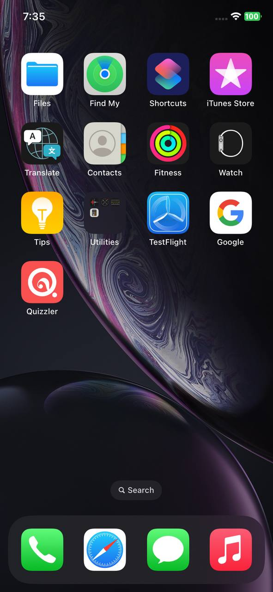
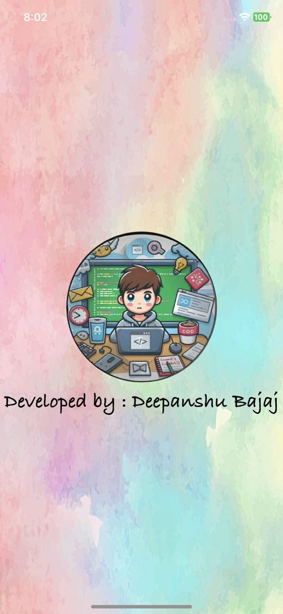
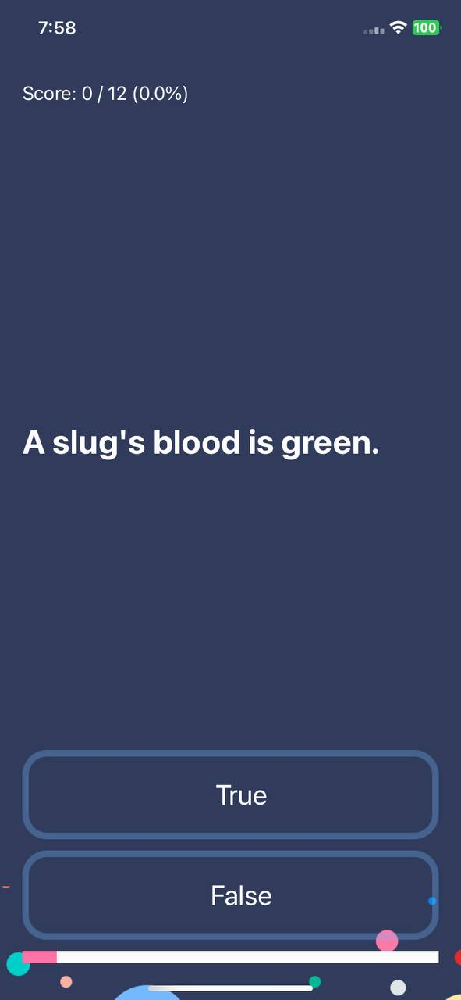
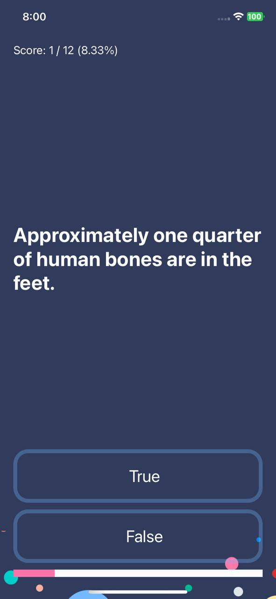
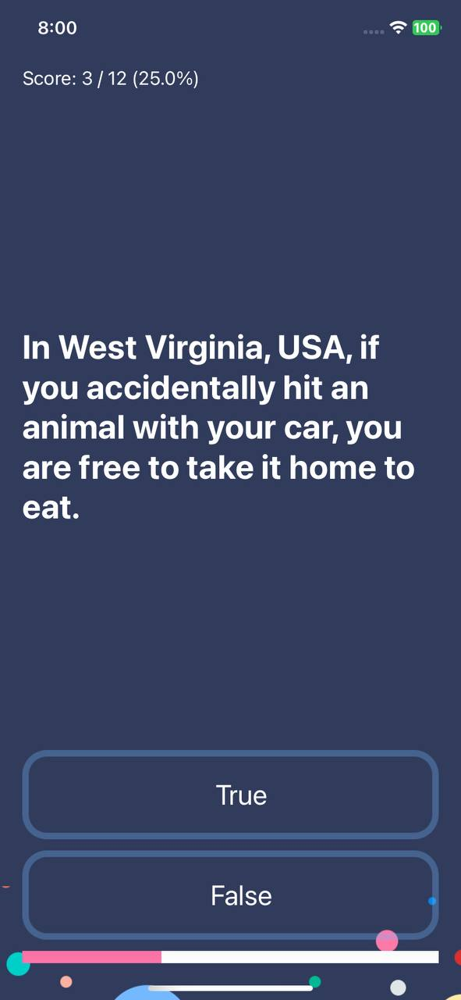
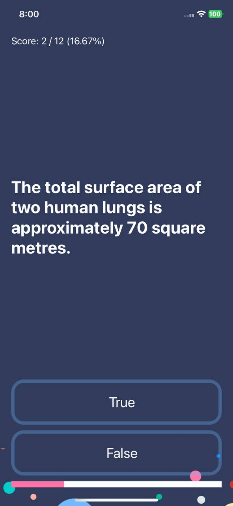
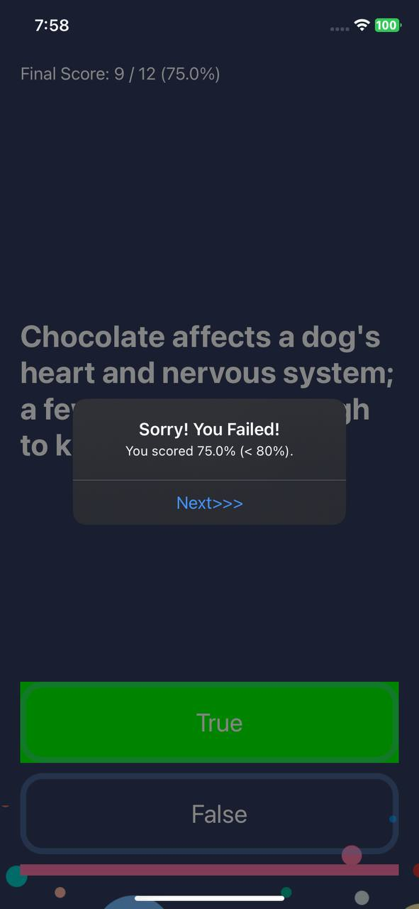
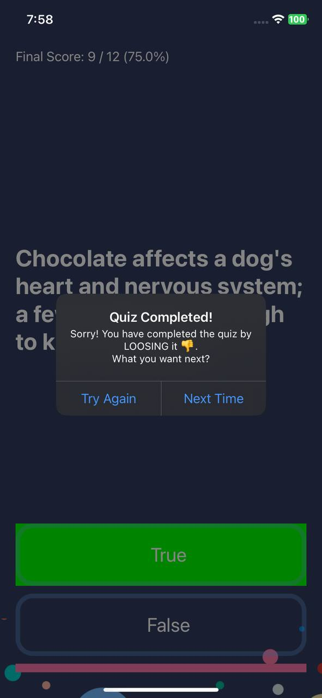
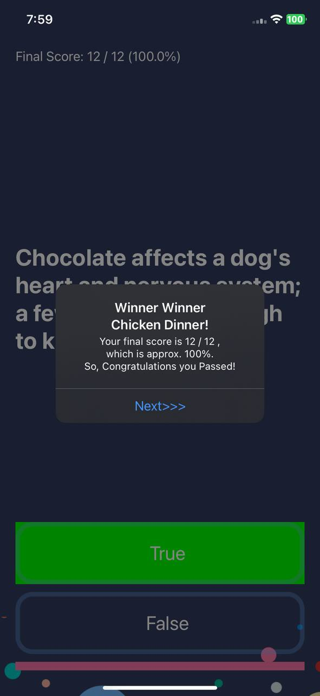
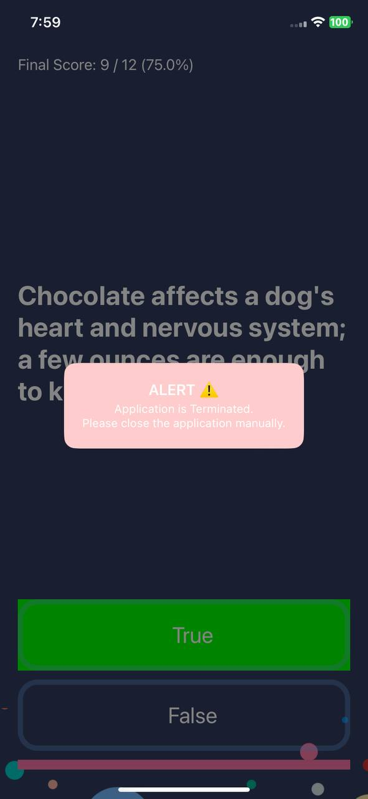

<h1 align="center">Quizzler - iOS App</h1>

**Quizzler** is a fun and engaging Quiz app that tests your knowledge with True/False questions! Whether you're preparing for a trivia night or just love challenges, this app provides an entertaining and educational experience. Answer questions, see your score, and challenge yourself to improve your knowledge!

## Features :

- **True/False Questions**: Answer multiple questions with a simple True/False choice.
- **Interactive UI**: A simple, colorful design that makes taking quizzes enjoyable for all ages.
- **Real-Time Feedback**: Instantly see if your answer was correct or incorrect.
- **Score Tracking**: Keep track of your score and see how well you did at the end of each quiz.

## Installation :

To run this project locally:

1. Clone the repository:
    ```bash
    git clone https://github.com/deepanshubajaj/Quizzler-iOSApp.git
    ```

2. Open the project in Xcode:
    ```bash
    open Quizzler.xcodeproj
    ```

3. Build and run the app on a simulator or physical device.

> Make sure you have Xcode installed and configured properly to run the project.

## App Look :

<p align="center">
  
</p>
<p align="center">
  *App snapshot in the simulator.*
</p>

## Screenshots :

<p align="center">
  
</p>
<p align="center">
  *Splash screen displayed upon app launch.*
</p>

<p align="center">
  <div style="display: flex; justify-content: center; gap: 10px;">
    
    
    
  </div>
</p>

<p align="center">
  <div style="display: flex; justify-content: center; gap: 10px;">
    
    
    
  </div>
</p>

<p align="center">
  <div style="display: flex; justify-content: center; gap: 10px;">
    
    
    
  </div>
</p>

<p align="center">
  *Screenshots of the Quizzler app showing different stages of the main quiz screen.*
</p>

## App Icon :

<p align="center">
  
</p>
<p align="center">
  *The app icon reflects the fun, educational theme of the Quizzler app.*
</p>

## Video Demo :

Here’s a short video showcasing the app's functionality:

<p align="center">
  
</p>

[Watch Working Video](ProjectOutputs/WorkingVideo/workingVideo.MP4)
